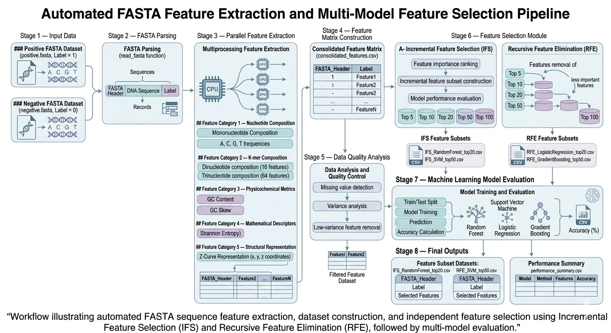

# BioLove

BioLove is a command-line bioinformatics toolkit for automated FASTA sequence feature extraction and machine-learning driven feature selection.

The tool transforms biological sequences into structured feature matrices and performs independent feature selection using Incremental Feature Selection (IFS) and Recursive Feature Elimination (RFE) across multiple machine learning models.

---

## PyPI Package

BioLove is available on the Python Package Index:

https://pypi.org/project/biolove/1.0.0/

---

## Workflow



*Workflow illustrating automated FASTA sequence feature extraction, dataset construction, and independent feature selection using Incremental Feature Selection (IFS) and Recursive Feature Elimination (RFE), followed by multi-model evaluation.*

---

## Key Features

* FASTA sequence parsing
* Large-scale feature extraction
* Nucleotide composition descriptors
* Dinucleotide and trinucleotide frequencies
* GC content and GC skew
* Shannon entropy
* Z-curve representation
* Data analysis and feature normalization
* Independent feature selection pipelines:

  * Incremental Feature Selection (IFS)
  * Recursive Feature Elimination (RFE)
* Multiple machine learning models
* Multi-core parallel processing
* Structured CSV outputs ready for downstream modelling

---

## Installation

Install directly from PyPI:

```bash
pip install biolove
```

---

## Command Line Usage

BioLove can be executed from the command line after installation.

Example:

```bash
biolove --pos positive.fasta --neg negative.fasta --out results --cores 8
```

---

## CLI Help

Running the help command:

```bash
biolove --help
```

Displays:

```
usage: biolove [-h] --pos POS --neg NEG --out OUT [--cores CORES]

BioLove: FASTA Feature Extraction and Feature Selection Pipeline

options:
  -h, --help     show this help message and exit
  --pos POS      Positive FASTA file
  --neg NEG      Negative FASTA file
  --out OUT      Output directory
  --cores CORES  CPU cores
```

---

## Output

Running BioLove generates a structured output directory containing feature datasets and model evaluation results.

Example structure:

```
results/

consolidated_features.csv

IFS_RandomForest_top5.csv
IFS_RandomForest_top10.csv
IFS_SVM_top20.csv

RFE_LogisticRegression_top20.csv
RFE_SVM_top50.csv

performance_summary.csv
```

Each feature dataset contains:

```
FASTA_Header
Label
Selected_Features
```

These files can be directly used for downstream machine learning models.

---

## Feature Categories

BioLove extracts biologically meaningful sequence descriptors including:

### Nucleotide Composition

* Mononucleotide frequencies
* Dinucleotide composition
* Trinucleotide composition

### Physicochemical Properties

* GC content
* GC skew

### Mathematical Descriptors

* Shannon entropy

### Structural Representation

* Z-curve coordinates

---

## Feature Selection Strategies

BioLove implements two independent feature selection pipelines.

### Incremental Feature Selection (IFS)

Features are ranked by importance and incrementally evaluated across multiple machine learning models to identify optimal subsets.

### Recursive Feature Elimination (RFE)

Features are recursively removed according to model importance until optimal feature subsets remain.

---

## Machine Learning Models

Feature subsets are evaluated using:

* Random Forest
* Support Vector Machine
* Logistic Regression
* Gradient Boosting

---

## Author

Love Kaushik

---

## License

MIT License
